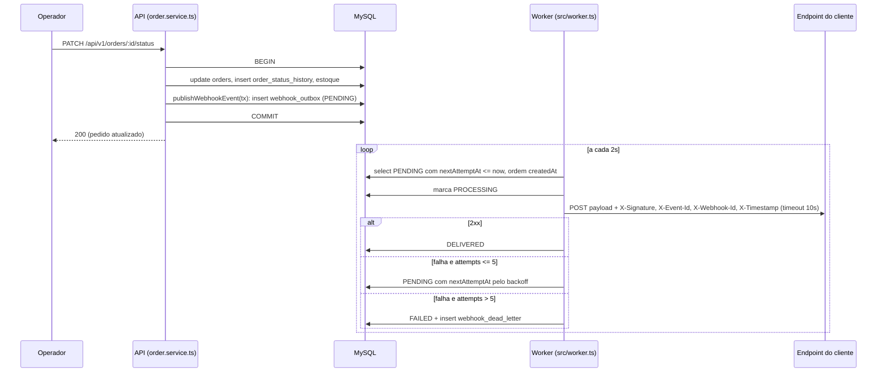
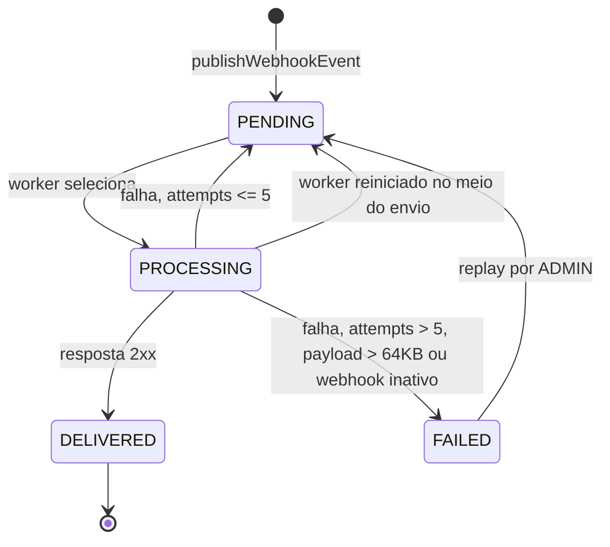

### FDD: Sistema de Webhooks de Notificação de Pedidos

Versão: 1.0
Data: 26/09/2026
Responsável: Diego Ferreira

Documentos relacionados: [PRD](PRD.md), [RFC](RFC.md), [ADRs](adrs/README.md), [Tracker](TRACKER.md)

---

### 1. Contexto e motivação técnica

O OMS precisa avisar clientes B2B, por HTTP, sempre que o status de um pedido mudar, em menos de 10 segundos ([09:02] Marcos). É um webhook só de saída ([09:02] Marcos, [09:03] Sofia).

Hoje o status muda em `OrderService.changeStatus` (`src/modules/orders/order.service.ts`), dentro de `this.prisma.$transaction`. A transação valida a transição com `canTransition` (`src/modules/orders/order.status.ts`), debita ou repõe estoque, atualiza `orders` e grava `order_status_history`. O problema técnico é publicar um evento confiável a partir dessa transação sem colocar chamada HTTP dentro dela ([09:04] Bruno) e sem perder evento quando a transação confirma ([09:40] Bruno).

A arquitetura aprovada está no [RFC](RFC.md) e nos [ADRs](adrs/README.md): outbox no MySQL (ADR-001), worker separado com polling (ADR-002), retry com DLQ (ADR-003), HMAC por endpoint (ADR-004), at-least-once (ADR-005), reuso de padrões (ADR-006) e payload como snapshot (ADR-007). Este documento detalha como construir.

**Atores**
- Usuário autenticado da API que representa o cliente B2B e gerencia os webhooks, com JWT do nosso sistema e qualquer role ([09:32] Marcos, [09:37] Sofia).
- Usuário com role ADMIN, que reprocessa eventos da DLQ ([09:36] Sofia).
- Operador que muda o status do pedido via `PATCH /api/v1/orders/:id/status` e, sem saber, dispara o evento.
- Worker de webhooks (`src/worker.ts`).
- Endpoint HTTPS do cliente, que recebe os eventos.

**Suposições**
- Hipótese: qualquer resposta HTTP 2xx do cliente conta como entrega bem sucedida. Qualquer outro status, erro de rede ou timeout conta como falha. A reunião não detalhou isso.
- Hipótese: um mesmo cliente tem poucos webhooks cadastrados, então o filtro por status pode ser feito em memória depois de buscar os webhooks ativos do cliente.
- Só a mudança de status via `changeStatus` gera evento. A criação do pedido (`OrderService.create`, que já nasce em `PENDING`) não passa por esse método e não gera evento. Como nenhuma transição em `order.status.ts` leva para `PENDING`, o filtro de status aceita apenas `PAID`, `PROCESSING`, `SHIPPED`, `DELIVERED` e `CANCELLED`.

**Restrições**
- Nenhuma infraestrutura nova. Mesmo MySQL, mesmo Prisma, mesma stack ([09:07] Diego, [09:11] Diego).
- Nenhuma biblioteca nova. Pino, Zod, AppError e o middleware de erro são reaproveitados ([09:29] Bruno, [09:30] Larissa).
- Um único worker nesta fase ([09:12] Diego).

---

### 2. Objetivos técnicos
- Latência entre o commit da mudança de status e a primeira tentativa de entrega abaixo de 10 segundos no p95, com cliente saudável. O intervalo de polling é de 2 segundos ([09:02] Marcos, [09:09] Diego, [09:10] Larissa).
- Invariante de atomicidade: para todo registro novo em `order_status_history` gerado por `changeStatus` cujo status está no filtro de algum webhook ativo do cliente, existe exatamente uma linha em `webhook_outbox` por webhook interessado, gravada na mesma transação. Rollback de um desfaz o outro ([09:06] Diego, [09:40] Bruno).
- Invariante de término: todo evento termina como `DELIVERED` ou como `FAILED` com uma linha em `webhook_dead_letter`, depois de no máximo 1 envio inicial e 5 retentativas (1m, 5m, 30m, 2h, 12h) ([09:17] Larissa).
- Nenhuma chamada HTTP ao cliente leva mais de 10 segundos ([09:42] Diego).
- 100% das requisições enviadas levam `X-Event-Id`, `X-Signature`, `X-Timestamp`, `X-Webhook-Id` e `Content-Type: application/json` ([09:44] Diego, [09:44] Sofia).
- Nenhum payload acima de 64KB (65536 bytes) é enviado ([09:24] Diego, [09:24] Larissa).
- Zero mudanças de contrato nas rotas existentes de `/api/v1/orders`.

---

### 3. Escopo e exclusões

**Incluído**
- Tabelas `webhooks`, `webhook_outbox` e `webhook_dead_letter` com migration Prisma.
- Módulo `src/modules/webhooks` com CRUD de configuração, rotação de secret, histórico de entregas e replay administrativo.
- Função `publishWebhookEvent(tx, order, fromStatus, toStatus)` chamada dentro de `changeStatus`.
- Entry point `src/worker.ts`, script `npm run worker`, polling de 2s, envio com timeout de 10s, retry com backoff e DLQ.
- Assinatura HMAC-SHA256 com secret por endpoint e carência de 24h na rotação.
- Validação de URL https e limite de payload de 64KB.
- Logs estruturados e indicadores de observabilidade descritos na seção 7.

**Excluído**
- Aviso ao cliente por email quando o webhook falha. Fica para a próxima fase ([09:37] Larissa).
- Rate limiting de saída. Vamos observar e decidir depois ([09:39] Larissa).
- Dashboard visual para o cliente. É um projeto separado do time de frontend ([09:40] Larissa).
- Arquivamento de linhas antigas da outbox, por volta de 30 dias ([09:08] Diego).
- Múltiplos workers e garantia de ordem global ([09:13] Diego, [09:13] Larissa).
- Webhooks de entrada, do cliente para a plataforma ([09:02] Marcos).
- Restrição de role no CRUD de webhooks além de "autenticado" ([09:37] Sofia).
- Itens do pedido no payload ([09:43] Diego).

---

### 4. Fluxos detalhados e diagramas

#### 4.1 Modelo de dados

Adições em `prisma/schema.prisma`, no mesmo estilo dos modelos existentes (UUID em `Char(36)`, `@@map` em snake_case, índices explícitos):

```prisma
enum WebhookOutboxStatus {
  PENDING
  PROCESSING
  DELIVERED
  FAILED
}

model Webhook {
  id                      String    @id @default(uuid()) @db.Char(36)
  customerId              String    @db.Char(36)
  url                     String    @db.VarChar(2048)
  secret                  String    @db.VarChar(128)
  previousSecret          String?   @db.VarChar(128)
  previousSecretExpiresAt DateTime?
  statuses                Json
  active                  Boolean   @default(true)
  createdAt               DateTime  @default(now())
  updatedAt               DateTime  @updatedAt

  customer    Customer            @relation(fields: [customerId], references: [id], onDelete: Cascade)
  outbox      WebhookOutbox[]
  deadLetters WebhookDeadLetter[]

  @@index([customerId, active])
  @@map("webhooks")
}

model WebhookOutbox {
  id                 String              @id @db.Char(36) // é o event_id / X-Event-Id
  webhookId          String              @db.Char(36)
  orderId            String              @db.Char(36) // sem FK: o payload é snapshot (ADR-007)
  eventType          String              @db.VarChar(64)
  payload            Json
  status             WebhookOutboxStatus @default(PENDING)
  attempts           Int                 @default(0)
  nextAttemptAt      DateTime            @default(now())
  lastAttemptAt      DateTime?
  lastResponseStatus Int?
  lastResponseBody   String?             @db.Text
  lastDurationMs     Int?
  lastError          String?             @db.VarChar(500)
  deliveredAt        DateTime?
  createdAt          DateTime            @default(now())
  updatedAt          DateTime            @updatedAt

  webhook     Webhook             @relation(fields: [webhookId], references: [id], onDelete: Cascade)
  deadLetters WebhookDeadLetter[]

  @@index([status, nextAttemptAt])
  @@index([createdAt])
  @@index([webhookId, createdAt])
  @@map("webhook_outbox")
}

model WebhookDeadLetter {
  id           String    @id @default(uuid()) @db.Char(36)
  outboxId     String    @db.Char(36)
  webhookId    String    @db.Char(36)
  payload      Json
  reason       String    @db.VarChar(500)
  failedAt     DateTime  @default(now())
  replayedAt   DateTime?
  replayedById String?   @db.Char(36)

  outbox     WebhookOutbox @relation(fields: [outboxId], references: [id], onDelete: Cascade)
  webhook    Webhook       @relation(fields: [webhookId], references: [id], onDelete: Cascade)
  replayedBy User?         @relation("WebhookReplayedBy", fields: [replayedById], references: [id])

  @@index([outboxId])
  @@index([failedAt])
  @@map("webhook_dead_letter")
}
```

Notas sobre o modelo:
- `webhooks` guarda url, secret, customer_id e estado ativo ([09:21] Bruno). `statuses` é a lista de status que o webhook quer ouvir ([09:33] Marcos).
- A outbox tem índice por status e por `created_at` ([09:08] Diego). O índice composto `[status, nextAttemptAt]` atende a consulta do worker, e `[webhookId, createdAt]` atende o histórico de entregas.
- Uma linha da outbox é um evento para um webhook. Se dois webhooks do mesmo cliente querem o mesmo status, são duas linhas, cada uma com o seu `event_id`, porque URL, secret e retry são independentes por endpoint.
- `lastResponseBody` usa `@db.Text`, que no MySQL tem limite de 64KB. O corpo da resposta do cliente é truncado nesse tamanho antes de gravar.
- `WebhookDeadLetter.outboxId` não é único: se um evento reprocessado falhar de novo, ele gera uma nova linha na DLQ, e o histórico de falhas fica preservado.
- Os modelos `Customer` e `User` ganham os lados inversos das relações (`webhooks Webhook[]` e `webhookReplays WebhookDeadLetter[] @relation("WebhookReplayedBy")`).

#### 4.2 Parâmetros configuráveis

Novas variáveis em `src/config/env.ts`, todas com default, para não quebrar `.env` existentes:

| Variável | Default | Origem |
| --- | --- | --- |
| `WEBHOOK_POLL_INTERVAL_MS` | 2000 | [09:09] Diego |
| `WEBHOOK_HTTP_TIMEOUT_MS` | 10000 | [09:42] Diego |
| `WEBHOOK_MAX_PAYLOAD_BYTES` | 65536 | [09:24] Diego |
| `WEBHOOK_BATCH_SIZE` | 20 (hipótese) | "batch pequeno", [09:08] Diego |

A tabela de backoff (`[60s, 300s, 1800s, 7200s, 43200s]`) e a carência de rotação (24h) ficam como constantes em código, porque são decisões registradas em ADR e não ajustes de ambiente.

**Fluxo principal**

**A. Cadastro de webhook**
- O cliente chama `POST /api/v1/webhooks` com `customerId`, `url` e `statuses` ([09:31] Marcos).
- `authenticate` valida o JWT. Qualquer role é aceita ([09:37] Sofia).
- `validate({ body: createWebhookSchema })` valida o formato: `customerId` UUID, `url` como URL válida, `statuses` como lista não vazia de status permitidos.
- `WebhookService.create` confere se a URL usa `https:` e, se não usar, lança `WebhookInvalidUrlError` ([09:23] Sofia). Depois confere se o customer existe.
- O service gera a secret com `crypto.randomBytes(32)` em hexadecimal e grava o webhook com `active = true`.
- Responde `201` com o webhook e a `secret` em texto. É a única resposta, junto com a rotação, em que a secret aparece ([09:31] Marcos).

**B. Criação do evento na outbox (dentro de `changeStatus`)**
- `changeStatus` faz tudo o que já faz hoje: carrega o pedido, valida a transição, mexe no estoque, atualiza `orders` e grava `order_status_history`.
- Logo depois de `tx.orderStatusHistory.create`, chama `publishWebhookEvent(tx, order, from, to)` ([09:41] Bruno).
- `publishWebhookEvent` busca, com o mesmo `tx`, os webhooks com `customerId = order.customerId` e `active = true`, e filtra em memória os que têm `to` em `statuses` ([09:34] Bruno).
- Se nenhum webhook se interessa, retorna sem gravar nada ([09:34] Bruno).
- Para cada webhook interessado, gera `eventId = uuidv4()` e monta o payload (seção 5, contrato C8) com os dados do pedido naquele momento ([09:52] Larissa).
- Grava a linha em `webhook_outbox` com `status = PENDING`, `attempts = 0` e `nextAttemptAt = now()`.
- Qualquer erro aqui propaga e faz rollback da transação inteira, inclusive da mudança de status ([09:40] Bruno).

**C. Processamento pelo worker**
- `src/worker.ts` sobe, cria o logger e usa o `prisma` de `src/config/database.ts`, que é uma instância própria desse processo ([09:30] Bruno).
- Na inicialização, linhas presas em `PROCESSING` (sobra de um worker que caiu no meio do envio) voltam para `PENDING`. Isso pode gerar reenvio, e o at-least-once cobre esse caso (ADR-005).
- A cada ciclo, o worker seleciona até `WEBHOOK_BATCH_SIZE` linhas com `status = PENDING` e `nextAttemptAt <= now()`, ordenadas por `createdAt` ascendente, e marca todas como `PROCESSING`.
- Processa as linhas **uma de cada vez, em ordem**, para manter a ordem por pedido ([09:12] Diego).
- Para cada linha: carrega o webhook. Se estiver inativo, vai direto para a DLQ com `WEBHOOK_INACTIVE`. Se a secret estiver vazia, vai para a DLQ com `WEBHOOK_SECRET_REQUIRED`.
- Serializa o payload. Se passar de 64KB, vai direto para a DLQ com `WEBHOOK_PAYLOAD_TOO_LARGE`, sem retry ([09:23] Sofia).
- Assina o corpo com HMAC-SHA256 e monta os headers (seção 5, contrato C8).
- Faz o `POST` com o `fetch` nativo do Node 20 e `AbortSignal.timeout(WEBHOOK_HTTP_TIMEOUT_MS)`.
- Se a resposta for 2xx, marca `DELIVERED`, grava `deliveredAt`, `lastResponseStatus`, `lastResponseBody` e `lastDurationMs`.
- Se falhar, segue o fluxo de retry (D).
- Terminado o lote, espera `WEBHOOK_POLL_INTERVAL_MS` e começa o próximo ciclo. O intervalo conta a partir do fim do ciclo, para nunca haver dois ciclos sobrepostos.
- Com `SIGINT` ou `SIGTERM`, o worker termina a linha em andamento, para o loop e chama `prisma.$disconnect()`, do mesmo jeito que `src/server.ts` faz.

**Fluxos alternativos e exceções**

**D. Retry com backoff**
- Em falha (status não 2xx, erro de rede ou timeout), o worker faz `attempts = attempts + 1` e grava `lastAttemptAt`, `lastError` e, se houver, `lastResponseStatus` e `lastResponseBody`.
- Se `attempts <= 5`, volta a linha para `PENDING` com `nextAttemptAt = now() + BACKOFF[attempts - 1]`, ou seja, 1m, 5m, 30m, 2h e 12h ([09:17] Diego).
- Se `attempts > 5`, segue para a DLQ (E). No total são 6 envios: o inicial e mais 5 retentativas, numa janela de cerca de 14h36 ([09:17] Diego). A interpretação está justificada no ADR-003.

**E. Envio para a DLQ**
- Numa transação: a linha da outbox fica `FAILED` e é criada uma linha em `webhook_dead_letter` com `outboxId`, `webhookId`, `payload`, `reason` (código `WEBHOOK_*` e mensagem) e `failedAt` ([09:18] Diego).
- O worker registra o log `webhook_dead_lettered` em nível `warn`.

**F. Replay manual da DLQ**
- Um ADMIN chama `POST /api/v1/admin/webhooks/dead-letter/:id/replay` ([09:35] Diego).
- `authenticate` e `requireRole('ADMIN')` barram quem não é ADMIN com `403 FORBIDDEN` ([09:36] Sofia).
- Numa transação, o service confere se a linha da DLQ existe e se ainda não foi reprocessada. Depois volta a linha da outbox para `PENDING`, com `attempts = 0`, `nextAttemptAt = now()` e `lastError = null`, mantendo o mesmo `id`, ou seja, o mesmo `X-Event-Id`. Por fim grava `replayedAt` e `replayedById` na DLQ ([09:18] Diego).
- Registra o log `webhook_dead_letter_replayed` com `deadLetterId`, `eventId`, `adminUserId` e `requestId`, para auditoria ([09:36] Sofia).
- Responde `202`. A entrega acontece no próximo ciclo do worker.

**G. Rotação de secret**
- O cliente chama `POST /api/v1/webhooks/:id/rotate-secret` ([09:21] Sofia).
- O service copia a secret atual para `previousSecret`, define `previousSecretExpiresAt = now() + 24h` e grava uma secret nova.
- Durante a carência, o worker assina com as duas secrets (formato na seção 5, contrato C8). Depois de `previousSecretExpiresAt`, só a nova é usada.
- Se houver uma segunda rotação dentro das 24h, a secret mais antiga é descartada na hora e só a imediatamente anterior segue em carência.

**H. Edição e remoção**
- `PATCH` altera `url`, `statuses` e `active`. A regra de https vale também aqui. A edição não afeta eventos que já estão na outbox, porque o payload é snapshot. Já a URL e a secret são lidas na hora do envio.
- `DELETE` remove o webhook. Pela cascata, os eventos pendentes e as linhas de DLQ dele também são removidos. Para só pausar as entregas, o cliente usa `PATCH` com `active: false`.

**Diagramas**

Sequência da mudança de status até a entrega:



Estados de uma linha da outbox:



---

### 5. Contratos públicos (assinaturas, endpoints, headers, exemplos)

Todas as rotas HTTP ficam sob `/api/v1`, montadas em `src/routes/index.ts`. Todas exigem `Authorization: Bearer <jwt>`. Erros seguem o formato do `errorMiddleware`: `{ "error": { "code", "message", "details?" } }`. O `customerId` nunca vem do JWT: vai no body no cadastro e na query string na listagem ([09:32] Larissa), igual ao que `order.schemas.ts` já faz com `customerId`. A confirmação disso está como questão aberta no RFC.

**C1. Cadastrar webhook**
- Tipo: endpoint
- Assinatura/Rota: `POST /api/v1/webhooks`
- Método: POST
- Semântica de status/headers:
  - `201`: webhook criado. A resposta traz a `secret`, que não volta a aparecer em nenhuma leitura.
  - `400 VALIDATION_ERROR`: body fora do schema (URL malformada, `statuses` vazio ou com valor inválido).
  - `400 WEBHOOK_INVALID_URL`: URL sem https.
  - `404 WEBHOOK_CUSTOMER_NOT_FOUND`: `customerId` não existe.
  - `401 UNAUTHORIZED`: sem token ou com token inválido.

**Exemplo de requisição**
```json
{
  "customerId": "3f1c2a9e-6b7d-4e21-9a0f-2c5d8e7b1a44",
  "url": "https://integracao.atlascomercial.com.br/webhooks/pedidos",
  "statuses": ["SHIPPED", "DELIVERED"]
}
```

**Exemplo de resposta**
```json
{
  "id": "b8e4f0d2-1c3a-4f5e-9d7b-6a2c1e0f3b99",
  "customerId": "3f1c2a9e-6b7d-4e21-9a0f-2c5d8e7b1a44",
  "url": "https://integracao.atlascomercial.com.br/webhooks/pedidos",
  "statuses": ["SHIPPED", "DELIVERED"],
  "active": true,
  "secret": "9f2b7c1e4a8d3f6b0e5c2a9d7f1b4e8c3a6d0f9b2e5c8a1d4f7b0e3c6a9d2f5b",
  "createdAt": "2026-10-05T13:02:11.000Z",
  "updatedAt": "2026-10-05T13:02:11.000Z"
}
```

**C2. Listar webhooks de um cliente**
- Tipo: endpoint
- Assinatura/Rota: `GET /api/v1/webhooks?customerId=:customerId&page=1&pageSize=20`
- Método: GET
- Semântica de status/headers:
  - `200`: lista paginada no formato de `src/shared/http/response.ts`. Nunca inclui `secret` nem `previousSecret`.
  - `400 VALIDATION_ERROR`: `customerId` ausente ou inválido.

**Exemplo de requisição**
```json
{}
```

**Exemplo de resposta**
```json
{
  "data": [
    {
      "id": "b8e4f0d2-1c3a-4f5e-9d7b-6a2c1e0f3b99",
      "customerId": "3f1c2a9e-6b7d-4e21-9a0f-2c5d8e7b1a44",
      "url": "https://integracao.atlascomercial.com.br/webhooks/pedidos",
      "statuses": ["SHIPPED", "DELIVERED"],
      "active": true,
      "previousSecretExpiresAt": null,
      "createdAt": "2026-10-05T13:02:11.000Z",
      "updatedAt": "2026-10-05T13:02:11.000Z"
    }
  ],
  "pagination": { "page": 1, "pageSize": 20, "total": 1, "totalPages": 1 }
}
```

**C3. Editar webhook**
- Tipo: endpoint
- Assinatura/Rota: `PATCH /api/v1/webhooks/:id`
- Método: PATCH
- Semântica de status/headers:
  - `200`: webhook atualizado, sem `secret`.
  - `400 VALIDATION_ERROR` ou `400 WEBHOOK_INVALID_URL`: mesmas regras do cadastro.
  - `404 WEBHOOK_NOT_FOUND`: id inexistente.

**Exemplo de requisição**
```json
{
  "statuses": ["PAID", "SHIPPED", "DELIVERED", "CANCELLED"],
  "active": true
}
```

**Exemplo de resposta**
```json
{
  "id": "b8e4f0d2-1c3a-4f5e-9d7b-6a2c1e0f3b99",
  "customerId": "3f1c2a9e-6b7d-4e21-9a0f-2c5d8e7b1a44",
  "url": "https://integracao.atlascomercial.com.br/webhooks/pedidos",
  "statuses": ["PAID", "SHIPPED", "DELIVERED", "CANCELLED"],
  "active": true,
  "previousSecretExpiresAt": null,
  "createdAt": "2026-10-05T13:02:11.000Z",
  "updatedAt": "2026-10-06T09:15:40.000Z"
}
```

**C4. Remover webhook**
- Tipo: endpoint
- Assinatura/Rota: `DELETE /api/v1/webhooks/:id`
- Método: DELETE
- Semântica de status/headers:
  - `204`: removido, sem corpo. Eventos pendentes e DLQ desse webhook são apagados em cascata.
  - `404 WEBHOOK_NOT_FOUND`: id inexistente.

**Exemplo de requisição**
```json
{}
```

**Exemplo de resposta**
```json
{}
```

**C5. Rotacionar secret**
- Tipo: endpoint
- Assinatura/Rota: `POST /api/v1/webhooks/:id/rotate-secret`
- Método: POST
- Semântica de status/headers:
  - `200`: secret nova devolvida. A anterior continua sendo usada em paralelo até `previousSecretExpiresAt`, que é 24h depois ([09:21] Sofia).
  - `404 WEBHOOK_NOT_FOUND`: id inexistente.

**Exemplo de requisição**
```json
{}
```

**Exemplo de resposta**
```json
{
  "id": "b8e4f0d2-1c3a-4f5e-9d7b-6a2c1e0f3b99",
  "secret": "4c8a1e7d0b3f6a9c2e5d8b1f4a7c0e3d6b9f2a5c8e1d4b7a0f3c6e9d2b5a8f1c",
  "previousSecretExpiresAt": "2026-10-07T10:00:00.000Z"
}
```

**C6. Histórico de entregas**
- Tipo: endpoint
- Assinatura/Rota: `GET /api/v1/webhooks/:id/deliveries?page=1&pageSize=100`
- Método: GET
- Semântica de status/headers:
  - `200`: eventos desse webhook em ordem decrescente de criação, com status, payload, resposta do cliente e tempo de resposta da última tentativa ([09:34] Marcos). `pageSize` vai até 100, que cobre o caso "últimos 100 envios".
  - `404 WEBHOOK_NOT_FOUND`: id inexistente.
  - Hipótese: quando o evento está na DLQ, a resposta traz `deadLetterId`. É o que permite ao ADMIN achar o id para o replay, já que a reunião não definiu uma listagem própria da DLQ.

**Exemplo de requisição**
```json
{}
```

**Exemplo de resposta**
```json
{
  "data": [
    {
      "eventId": "e1a7c3f9-2b4d-4c6e-8f0a-1b3d5f7a9c2e",
      "orderId": "7d9b1f3a-5c2e-4a8d-b6f0-3e1c9a7b5d2f",
      "eventType": "order.status_changed",
      "status": "DELIVERED",
      "attempts": 1,
      "lastAttemptAt": "2026-10-06T14:20:03.120Z",
      "lastResponseStatus": 200,
      "lastResponseBody": "{\"received\":true}",
      "lastDurationMs": 184,
      "lastError": null,
      "deliveredAt": "2026-10-06T14:20:03.304Z",
      "deadLetterId": null,
      "payload": {
        "event_id": "e1a7c3f9-2b4d-4c6e-8f0a-1b3d5f7a9c2e",
        "event_type": "order.status_changed",
        "timestamp": "2026-10-06T14:20:01.870Z",
        "order_id": "7d9b1f3a-5c2e-4a8d-b6f0-3e1c9a7b5d2f",
        "order_number": "ORD-000123",
        "from_status": "PROCESSING",
        "to_status": "SHIPPED",
        "customer_id": "3f1c2a9e-6b7d-4e21-9a0f-2c5d8e7b1a44",
        "total_cents": 18500
      },
      "createdAt": "2026-10-06T14:20:01.870Z"
    }
  ],
  "pagination": { "page": 1, "pageSize": 100, "total": 1, "totalPages": 1 }
}
```

**C7. Replay de evento da DLQ**
- Tipo: endpoint
- Assinatura/Rota: `POST /api/v1/admin/webhooks/dead-letter/:id/replay`
- Método: POST
- Semântica de status/headers:
  - `202`: evento recolocado na outbox como `PENDING`, com o mesmo `event_id`. A entrega acontece no próximo ciclo do worker.
  - `403 FORBIDDEN`: usuário sem role ADMIN ([09:36] Sofia).
  - `404 WEBHOOK_DEAD_LETTER_NOT_FOUND`: id inexistente.
  - `409 WEBHOOK_DEAD_LETTER_ALREADY_REPLAYED`: esse item já foi reprocessado.

**Exemplo de requisição**
```json
{}
```

**Exemplo de resposta**
```json
{
  "deadLetterId": "c2e4a6b8-0d1f-4a3c-9e5b-7d9f1b3c5e7a",
  "eventId": "e1a7c3f9-2b4d-4c6e-8f0a-1b3d5f7a9c2e",
  "status": "PENDING",
  "replayedAt": "2026-10-07T08:31:12.000Z",
  "replayedBy": "a1b2c3d4-e5f6-4a7b-8c9d-0e1f2a3b4c5d"
}
```

**C8. Entrega do evento ao cliente (saída)**
- Tipo: endpoint (chamado por nós no sistema do cliente)
- Assinatura/Rota: `POST {url cadastrada}`
- Método: POST
- Semântica de status/headers:
  - `Content-Type: application/json` ([09:44] Diego).
  - `X-Event-Id`: UUID do evento, igual ao `event_id` do payload. Não muda em retry nem em replay. É a chave de deduplicação do cliente ([09:25] Diego).
  - `X-Webhook-Id`: id do webhook cadastrado, para o cliente que tem vários cadastros ([09:44] Sofia).
  - `X-Timestamp`: momento do envio em ISO 8601, para o cliente detectar replay attack se quiser ([09:44] Diego). É diferente do `timestamp` do payload, que marca a mudança de status.
  - `X-Signature`: `sha256=<hex>` com o HMAC-SHA256 do corpo exato enviado, usando a secret do webhook ([09:20] Sofia). Durante a carência de rotação vão duas assinaturas separadas por vírgula, `sha256=<nova>,sha256=<anterior>`, e o cliente aceita se qualquer uma bater. O prefixo e o separador são proposta deste FDD e passam pela revisão da Sofia.
  - Resposta 2xx do cliente: entregue. Qualquer outra resposta, erro de rede ou demora maior que 10s: falha com retry ([09:42] Diego).
  - Limites: corpo de no máximo 64KB e timeout de 10s.
  - Versionamento: `event_type` identifica o tipo e o formato do evento. Campos novos só entram de forma aditiva.

**Exemplo de requisição**
```json
{
  "event_id": "e1a7c3f9-2b4d-4c6e-8f0a-1b3d5f7a9c2e",
  "event_type": "order.status_changed",
  "timestamp": "2026-10-06T14:20:01.870Z",
  "order_id": "7d9b1f3a-5c2e-4a8d-b6f0-3e1c9a7b5d2f",
  "order_number": "ORD-000123",
  "from_status": "PROCESSING",
  "to_status": "SHIPPED",
  "customer_id": "3f1c2a9e-6b7d-4e21-9a0f-2c5d8e7b1a44",
  "total_cents": 18500
}
```

**Exemplo de resposta**
```json
{ "received": true }
```

O corpo da resposta do cliente é livre. Só o status HTTP importa, e o corpo é guardado para o histórico.

**C9. Função de publicação (contrato interno entre módulos)**
- Tipo: function
- Assinatura/Rota: `publishWebhookEvent(tx: Prisma.TransactionClient, order: Pick<Order, 'id' | 'orderNumber' | 'customerId' | 'totalCents'>, fromStatus: OrderStatus, toStatus: OrderStatus): Promise<void>` em `src/modules/webhooks/webhook.publisher.ts` ([09:41] Bruno).
- Semântica: só usa o `tx` recebido e nunca abre transação própria. Não retorna nada. Qualquer erro sobe e faz rollback da transação de quem chamou.

---

### 6. Erros, exceções e fallback

#### 6.1 Matriz de erros previstos e tratamentos

Todas as classes novas herdam de `AppError` e ficam em `src/modules/webhooks/webhook.errors.ts`, exportadas junto com as demais. Os códigos usam o prefixo `WEBHOOK_` ([09:28] Bruno, [09:29] Larissa).

| Código | Onde ocorre | HTTP | Condição | Tratamento |
| --- | --- | --- | --- | --- |
| `WEBHOOK_INVALID_URL` | API (service) | 400 | URL não usa `https:` no cadastro ou na edição ([09:23] Sofia) | Recusa a operação e não grava nada |
| `WEBHOOK_NOT_FOUND` | API | 404 | Webhook inexistente em PATCH, DELETE, rotação ou histórico | Resposta 404 |
| `WEBHOOK_CUSTOMER_NOT_FOUND` | API | 404 | `customerId` do cadastro não existe | Resposta 404 |
| `WEBHOOK_DEAD_LETTER_NOT_FOUND` | API (admin) | 404 | Id de DLQ inexistente no replay | Resposta 404 |
| `WEBHOOK_DEAD_LETTER_ALREADY_REPLAYED` | API (admin) | 409 | Item da DLQ com `replayedAt` preenchido | Resposta 409. Se falhar de novo, o evento gera um item novo na DLQ, que pode ser reprocessado |
| `WEBHOOK_SECRET_REQUIRED` | Worker | n/a | Webhook sem secret no momento de assinar | Não envia. Vai direto para a DLQ, sem retry, e loga em `error` |
| `WEBHOOK_INACTIVE` | Worker | n/a | Webhook desativado depois que o evento entrou na outbox | Não envia. Vai para a DLQ, o que permite replay depois da reativação |
| `WEBHOOK_PAYLOAD_TOO_LARGE` | Worker | n/a | Corpo serializado maior que 64KB ([09:23] Sofia, [09:24] Larissa) | Não envia e não trunca. Vai direto para a DLQ e loga em `error` |
| `WEBHOOK_DELIVERY_TIMEOUT` | Worker | n/a | Cliente não respondeu em 10s ([09:42] Diego) | Falha com retry pelo backoff |
| `WEBHOOK_DELIVERY_HTTP_ERROR` | Worker | n/a | Resposta fora da faixa 2xx | Falha com retry. Guarda status e corpo |
| `WEBHOOK_DELIVERY_NETWORK_ERROR` | Worker | n/a | DNS, conexão recusada, erro de TLS | Falha com retry |
| `WEBHOOK_MAX_ATTEMPTS_EXCEEDED` | Worker | n/a | Falhou no envio inicial e nas 5 retentativas | Linha `FAILED` e item na DLQ. O motivo inclui o último erro |
| `VALIDATION_ERROR` (existente) | API | 400 | Body, query ou params fora do schema Zod | Tratado pelo `validate` e pelo `errorMiddleware`, sem mudança |
| `FORBIDDEN` (existente) | API (admin) | 403 | Replay feito por quem não é ADMIN | Tratado pelo `requireRole` |
| Erro qualquer em `publishWebhookEvent` | API (orders) | 500 | Falha de banco ao gravar a outbox | Rollback da mudança de status inteira. O operador tenta de novo |

Por que a checagem de https fica no service: o `validate` (`src/middlewares/validate.middleware.ts`) transforma qualquer falha de Zod em `VALIDATION_ERROR`, sem espaço para um código customizado. O schema Zod continua validando que o campo é uma URL. A regra "tem que ser https" é checada no `WebhookService`, que lança `WebhookInvalidUrlError` com status 400. O comportamento pedido pela Sofia (recusar http com erro de validação) fica igual, e o cliente recebe um código específico.

Nos erros do worker a coluna HTTP diz "n/a" porque esses códigos não viram resposta de API. Eles ficam gravados em `webhook_outbox.lastError` e em `webhook_dead_letter.reason`, aparecem no histórico de entregas (C6) e nos logs.

#### 6.2 Estratégias de resiliência
- **Timeout:** 10s por requisição, com `AbortSignal.timeout` ([09:42] Diego).
- **Retries:** até 5 retentativas depois do envio inicial ([09:15] Diego, [09:17] Larissa).
- **Backoff:** intervalos fixos crescentes de 1m, 5m, 30m, 2h e 12h, controlados por `nextAttemptAt` na própria linha ([09:17] Diego). Não existe `sleep` no processo. O agendamento é persistido, então sobrevive a restart do worker.
- **Isolamento:** a chamada HTTP acontece fora de qualquer transação de pedidos. Um cliente lento só atrasa o lote atual do worker, nunca a API ([09:04] Bruno).
- **Circuit breaker:** não entra nesta fase. O efeito equivalente vem do backoff por evento. O comportamento em rajadas será observado junto com o rate limiting ([09:39] Larissa).
- **Recuperação de crash:** linhas em `PROCESSING` voltam para `PENDING` quando o worker sobe.
- **Desligamento limpo:** `SIGINT` e `SIGTERM` encerram o loop depois da linha em andamento.

#### 6.3 Política de fallback
- Não existe canal alternativo de entrega nesta fase. Email ficou para a próxima fase ([09:37] Larissa).
- O fallback operacional é a DLQ com replay manual por ADMIN ([09:18] Diego).
- Para o cliente, a API atual continua disponível. `GET /api/v1/orders/:id` segue sendo a fonte da verdade para o estado atual do pedido ([09:43] Diego).

#### 6.4 Invariantes
- Não existe mudança de status confirmada sem a linha correspondente na outbox para cada webhook interessado ([09:40] Bruno).
- O `event_id` de um evento nunca muda: é o mesmo na inserção, nos retries e no replay.
- O payload gravado nunca é alterado depois da inserção.
- Nenhuma requisição sai sem `X-Signature`.
- Nenhuma requisição sai para URL que não seja https.
- `secret` e `previousSecret` nunca aparecem em respostas de leitura nem em logs.

---

### 7. Observabilidade

O projeto não tem biblioteca de métricas nem de tracing, e a decisão foi não trazer nada novo ([09:29] Bruno). Por isso a observabilidade usa o que já existe: logs estruturados com Pino, que servem de base para métricas e correlação, e consultas nas tabelas novas. O `event_id` funciona como id de correlação de ponta a ponta, inclusive do lado do cliente, que o recebe em `X-Event-Id`.

**Métricas**

Métricas derivadas de logs, contadas pela ferramenta de agregação de logs:
- `webhook_events_enqueued_total`: eventos gravados na outbox.
- `webhook_delivery_attempts_total{result}`: tentativas por resultado (`success`, `http_error`, `timeout`, `network_error`).
- `webhook_delivery_duration_ms`: duração de cada chamada HTTP (p50, p95, p99).
- `webhook_end_to_end_latency_ms`: `deliveredAt` menos `createdAt` nos eventos entregues na primeira tentativa. É a métrica da meta de 10s.
- `webhook_dead_lettered_total{reason}`: eventos enviados para a DLQ, por código.
- `webhook_replays_total`: replays feitos por ADMIN.

Métricas de estado, publicadas pelo worker no log de fim de ciclo:
- `pendingBacklog`: linhas `PENDING` com `nextAttemptAt <= now()`.
- `oldestPendingAgeMs`: idade da linha pendente mais antiga pronta para envio.
- `retryingCount`: linhas `PENDING` com `attempts > 0`.

Cardinalidade: as métricas agregadas não usam `webhookId` nem `customerId` como label. Esses campos ficam só nos logs, para investigação.

**Logs**

- Formato: JSON do Pino, com os campos base `service` e `env` já configurados em `src/shared/logger/index.ts`. O worker usa o mesmo logger, com um campo `component: "webhook-worker"`.
- Eventos e campos essenciais:

| Evento de log | Nível | Campos |
| --- | --- | --- |
| `webhook_worker_started` / `webhook_worker_stopped` | info | `pollIntervalMs`, `batchSize`, `signal` |
| `webhook_worker_cycle` | debug (info quando `claimed > 0`) | `claimed`, `delivered`, `failed`, `deadLettered`, `pendingBacklog`, `oldestPendingAgeMs`, `cycleDurationMs` |
| `webhook_delivery_succeeded` | info | `eventId`, `webhookId`, `orderId`, `attempt`, `statusCode`, `durationMs` |
| `webhook_delivery_failed` | warn | `eventId`, `webhookId`, `orderId`, `attempt`, `errorCode`, `statusCode`, `durationMs`, `nextAttemptAt` |
| `webhook_dead_lettered` | warn (error para `PAYLOAD_TOO_LARGE` e `SECRET_REQUIRED`) | `eventId`, `webhookId`, `deadLetterId`, `reason` |
| `webhook_dead_letter_replayed` | info | `deadLetterId`, `eventId`, `adminUserId`, `requestId` |
| `webhook_secret_rotated` | info | `webhookId`, `previousSecretExpiresAt`, `userId`, `requestId` |

- Proteção de dados: incluir `*.secret` e `*.previousSecret` em `redactPaths`. O corpo da resposta do cliente e o payload não vão para o log. Ficam só no banco, acessíveis pelo histórico de entregas.

**Tracing**

- Não existe tracing distribuído no projeto, e adicionar OpenTelemetry ficaria fora da decisão de não trazer ferramentas novas. O rastreio é feito por ids de correlação nos logs:
  - `requestId`, que já existe no `request-logger.middleware.ts`, nos logs das rotas de webhook e do replay.
  - `eventId` em todos os logs do ciclo de vida do evento (tentativas, DLQ e replay) e no header `X-Event-Id` enviado ao cliente.
  - `orderId` liga o evento ao pedido e ao `order_status_history`.
- Spans lógicos, representados como logs com `durationMs`: `webhook.worker.cycle`, `webhook.deliver` (uma por tentativa) e `webhook.dead_letter`.
- Amostragem: 100%. Com três clientes iniciais o volume é baixo.

**Dashboards e alertas**

- Painel: taxa de sucesso por tentativa, p95 de `webhook_end_to_end_latency_ms`, `pendingBacklog`, `oldestPendingAgeMs`, eventos na DLQ por motivo e replays.
- Alerta de worker parado: nenhum log `webhook_worker_cycle` por mais de 1 minuto (hipótese de limiar).
- Alerta de atraso: `oldestPendingAgeMs` acima de 10s por 5 minutos seguidos (hipótese de limiar, ligada à meta de 10s).
- Alerta de DLQ: qualquer `webhook_dead_lettered` novo, para alguém avaliar o replay.
- Sinal para a questão em aberto de rate limiting: número de eventos por `webhookId` por minuto, consultado na outbox.

---

### 8. Dependências e compatibilidade

| Componente | Versão mínima | Observações |
| --- | --- | --- |
| Node.js | 20 | Já exigido em `package.json` (`engines.node >= 20`). Usa `fetch` nativo, `AbortSignal.timeout` e `node:crypto` (HMAC e `randomBytes`) |
| MySQL | 8.0 | Imagem usada no `docker-compose.yml`. Colunas `Json` para `statuses` e `payload` |
| Prisma / @prisma/client | 5.22.0 | Nova migration aditiva em `prisma/migrations/` |
| Express | 4.21.1 | Novos routers montados em `src/routes/index.ts` |
| Zod | 3.23.8 | Schemas em `webhook.schemas.ts` |
| Pino | 9.5.0 | Logger compartilhado, com novos caminhos de `redact` |
| uuid | 11.0.3 | `v4` para o `event_id`, a mesma lib do `request-logger.middleware.ts` |
| tsx | 4.19.2 | Para `npm run worker` em desenvolvimento |

**Garantias de compatibilidade**

- A migration só adiciona tabelas, um enum e relações inversas. Nenhuma coluna existente muda.
- As rotas e respostas atuais de `/api/v1/orders` continuam iguais. O `PATCH /orders/:id/status` só ganha uma escrita a mais dentro da transação.
- Não entra nenhuma dependência nova em `package.json`. Entram só os scripts `worker` e `worker:start`.
- As variáveis de ambiente novas têm default, então os `.env` atuais continuam válidos.
- O payload é versionado por `event_type`. Mudanças no formato só adicionam campos, e o portal do desenvolvedor vai orientar o cliente a ignorar campos desconhecidos ([09:26] Marcos).
- O `tests/setup.ts` precisa limpar as tabelas novas antes das de `customers` e `users`, por causa das chaves estrangeiras.

---

### 9. Critérios de aceite técnicos

- Um `PATCH /api/v1/orders/:id/status` para um status assinado por um webhook ativo grava exatamente uma linha `PENDING` na outbox para esse webhook, na mesma transação.
- Uma mudança de status para um status que nenhum webhook ativo do cliente assina não grava nada na outbox.
- Se a inserção na outbox falhar (simulada em teste), o status do pedido, o `order_status_history` e o estoque ficam como estavam antes.
- Com cliente saudável, o p95 entre o commit e a entrega fica abaixo de 10s em teste com o worker rodando e intervalo de 2s.
- Um endpoint que responde 500 sempre recebe exatamente 6 chamadas (envio inicial e 5 retentativas), com `nextAttemptAt` respeitando 1m, 5m, 30m, 2h e 12h (validado com relógio controlado em teste), e termina `FAILED` com um item na DLQ.
- Um endpoint que demora mais de 10s é tratado como `WEBHOOK_DELIVERY_TIMEOUT` e entra em retry.
- Um payload acima de 65536 bytes nunca é enviado e vai para a DLQ com `WEBHOOK_PAYLOAD_TOO_LARGE`.
- Toda requisição de saída tem os cinco headers do contrato C8, e o `X-Signature` confere com o HMAC-SHA256 do corpo calculado com a secret do webhook.
- Depois de uma rotação, as requisições das próximas 24h levam as duas assinaturas. Depois disso, só a nova.
- `POST /api/v1/webhooks` com URL `http://` retorna `400 WEBHOOK_INVALID_URL`.
- `GET /api/v1/webhooks` e `GET /api/v1/webhooks/:id/deliveries` nunca retornam `secret`.
- O replay com token de OPERATOR retorna 403. Com ADMIN retorna 202, reenvia com o mesmo `X-Event-Id` e grava `replayedById`.
- Um segundo replay do mesmo item da DLQ retorna `409 WEBHOOK_DEAD_LETTER_ALREADY_REPLAYED`.
- Matar o worker no meio de um lote e subir de novo não perde evento: as linhas `PROCESSING` voltam para `PENDING` e são enviadas.
- Os logs do worker não contêm `secret`, e toda linha de log de entrega tem `eventId`.
- A suíte existente (`tests/orders.test.ts` e `tests/auth.test.ts`) continua passando sem alteração nas asserções.

---

### 10. Riscos e mitigação

### Transação de mudança de status fica mais lenta ou falha por causa da outbox

- **Probabilidade:** baixa
- **Impacto:** operadores não conseguem mudar status de pedidos, o que afeta a operação inteira.
- **Mitigação:**
    - A escrita na outbox é um insert simples, com uma leitura indexada por `[customerId, active]`.
    - Testes de integração cobrindo `changeStatus` com e sem webhooks cadastrados.
- **Plano de contingência:** desativar os webhooks do cliente afetado (`active = false`) faz o `publishWebhookEvent` não gravar nada, sem precisar de deploy.

### Evento de um pedido ultrapassa outro do mesmo pedido durante o backoff

- **Probabilidade:** média
- **Impacto:** o cliente recebe `SHIPPED` antes de `PROCESSING` quando o primeiro envio falhou e o segundo não.
- **Mitigação:**
    - Payload com `from_status`, `to_status` e `timestamp`, para o cliente conseguir ordenar.
    - Limitação documentada no portal: ordem só por pedido, com um único worker e com entregas bem sucedidas ([09:13] Larissa, [09:14] Marcos).
- **Plano de contingência:** o cliente consulta `GET /api/v1/orders/:id` para confirmar o estado atual.

### Worker parado sem ninguém perceber

- **Probabilidade:** média
- **Impacto:** eventos acumulam e a meta de 10s é violada para todos os clientes, embora nada se perca.
- **Mitigação:**
    - Alerta por ausência de `webhook_worker_cycle` e por `oldestPendingAgeMs`.
    - Processo separado da API, com restart independente ([09:11] Diego).
- **Plano de contingência:** reiniciar o worker. O backlog é enviado em ordem, lote a lote.

### Secret vazada no lado do cliente ou nos nossos logs

- **Probabilidade:** média, porque já aconteceu com um cliente ([09:22] Diego)
- **Impacto:** terceiros conseguem forjar eventos aceitos pelo cliente.
- **Mitigação:**
    - Secret por endpoint e rotação com carência de 24h ([09:21] Sofia).
    - `redact` do Pino para `secret` e `previousSecret`. A secret só aparece na criação e na rotação.
    - Revisão de segurança da Sofia, com pelo menos dois dias úteis, antes do deploy ([09:46] Sofia).
- **Plano de contingência:** rotacionar imediatamente. Em caso extremo, desativar o webhook.

### Secrets guardadas em texto no banco

- **Probabilidade:** baixa
- **Impacto:** um vazamento do banco expõe as secrets de todos os webhooks.
- **Mitigação:**
    - A secret precisa ser recuperável para assinar, então não pode ser só um hash. O armazenamento entra no escopo da revisão de segurança da Sofia ([09:46] Sofia).
- **Plano de contingência:** rotação em massa, com comunicação aos clientes.

### Rajada de eventos para um mesmo cliente

- **Probabilidade:** média
- **Impacto:** o endpoint do cliente recebe muitas chamadas seguidas e pode responder com erro, o que joga os eventos para retry.
- **Mitigação:**
    - Worker único processando em série, o que já limita a concorrência na prática.
    - Monitorar eventos por webhook por minuto, como previsto na seção 7 ([09:39] Diego).
- **Plano de contingência:** abrir a decisão de rate limiting que ficou em aberto no RFC.

---

### 11. Integração com o sistema existente

Esta seção lista cada arquivo do código atual que o módulo de webhooks toca ou reaproveita, e como.

| Arquivo | Tipo de integração | O que muda ou como é reaproveitado |
| --- | --- | --- |
| `src/modules/orders/order.service.ts` | Alterado | Em `changeStatus`, logo depois de `tx.orderStatusHistory.create(...)` e antes do `findUnique` que monta a resposta, entra a chamada `await publishWebhookEvent(tx, order, from, to)`. O `order` é o objeto já carregado no início da transação (tem `id`, `orderNumber`, `customerId` e `totalCents`), e `from` e `to` são as variáveis que o método já tem. O construtor do `OrderService` não muda ([09:40] Bruno, [09:41] Bruno) |
| `src/modules/orders/order.status.ts` | Reaproveitado, sem mudança | A tabela `transitions` define quais status podem ser alvo de evento. Como nenhuma transição leva a `PENDING`, o schema de `statuses` aceita só os outros cinco valores |
| `prisma/schema.prisma` | Alterado | Novos modelos `Webhook`, `WebhookOutbox`, `WebhookDeadLetter`, o enum `WebhookOutboxStatus` e as relações inversas em `Customer` e `User` (seção 4.1). Segue o padrão de UUID em `Char(36)` ([09:51] Larissa) |
| `prisma/migrations/` | Novo arquivo | Migration aditiva gerada com `npm run db:migrate` |
| `src/shared/errors/app-error.ts` | Reaproveitado | Todas as classes `Webhook*Error` herdam de `AppError`, passando `statusCode` e `errorCode` com prefixo `WEBHOOK_` ([09:28] Bruno) |
| `src/shared/errors/http-errors.ts` | Reaproveitado como base | Mesmo padrão de `InsufficientStockError` e `InvalidStatusTransitionError`, que estendem uma classe HTTP e fixam um código próprio. `WebhookInvalidUrlError` estende `BadRequestError` (400, aceita código), e `WebhookDeadLetterAlreadyReplayedError` estende `ConflictError` (409). `WebhookNotFoundError`, `WebhookCustomerNotFoundError` e `WebhookDeadLetterNotFoundError` estendem `AppError` direto com 404, porque o `NotFoundError` atual fixa o código `NOT_FOUND` |
| `src/shared/errors/index.ts` | Sem mudança | As classes de erro do webhook ficam no próprio módulo (`webhook.errors.ts`) e importam `AppError`, `BadRequestError` e `ConflictError` daqui |
| `src/middlewares/error.middleware.ts` | Reaproveitado, sem mudança | Já trata qualquer `AppError` pelo `statusCode` e `errorCode`, e também `ZodError` e os erros P2002 e P2025 do Prisma ([09:29] Bruno) |
| `src/middlewares/validate.middleware.ts` | Reaproveitado, sem mudança | Usado nas rotas com `createWebhookSchema`, `updateWebhookSchema`, `listWebhooksQuerySchema`, `listDeliveriesQuerySchema` e `webhookIdParamSchema`. Como ele sempre responde `VALIDATION_ERROR`, a regra de https fica no service (seção 6.1) |
| `src/middlewares/auth.middleware.ts` | Reaproveitado, sem mudança | `authenticate` em todas as rotas do módulo. `requireRole('ADMIN')` na rota de replay, do mesmo jeito que em `src/modules/users/user.routes.ts` ([09:36] Larissa). O `req.user.id` vira `replayedById` |
| `src/middlewares/request-logger.middleware.ts` | Reaproveitado, sem mudança | O `req.id` gerado aqui entra como `requestId` nos logs de replay e de rotação |
| `src/routes/index.ts` | Alterado | O tipo `Controllers` ganha `webhooks` e `webhooksAdmin`. `buildApiRouter` monta `router.use('/webhooks', buildWebhookRouter(...))` e `router.use('/admin/webhooks', buildWebhookAdminRouter(...))` |
| `src/app.ts` | Alterado | `buildControllers` instancia `WebhookRepository`, `WebhookService`, `WebhookController` e `WebhookAdminController` com o mesmo `prisma`, igual aos outros módulos |
| `src/server.ts` | Reaproveitado como modelo | `src/worker.ts` copia a estrutura: função `bootstrap`, log de início, tratamento de `SIGINT` e `SIGTERM` com `prisma.$disconnect()` e `logger.fatal` em falha de inicialização ([09:11] Larissa) |
| `src/config/database.ts` | Reaproveitado, sem mudança | O worker importa `prisma` daqui. Como é outro processo Node, ganha uma instância própria de `PrismaClient` com a mesma `DATABASE_URL` ([09:30] Bruno) |
| `src/config/env.ts` | Alterado | `envSchema` ganha `WEBHOOK_POLL_INTERVAL_MS`, `WEBHOOK_HTTP_TIMEOUT_MS`, `WEBHOOK_MAX_PAYLOAD_BYTES` e `WEBHOOK_BATCH_SIZE`, todos com `z.coerce.number()` e default |
| `src/shared/logger/index.ts` | Alterado | `redactPaths` ganha `'*.secret'` e `'*.previousSecret'`. O resto do logger é reaproveitado ([09:29] Bruno) |
| `src/shared/http/response.ts` | Reaproveitado, sem mudança | `paginated()` monta as respostas de C2 e C6 |
| `package.json` | Alterado | Novos scripts: `"worker": "tsx watch --env-file=.env src/worker.ts"` e `"worker:start": "node --env-file=.env dist/worker.js"` ([09:11] Larissa). O `tsconfig.build.json` já inclui `src/**/*.ts`, então `src/worker.ts` entra no build sem ajuste |
| `tests/setup.ts` | Alterado | O `beforeEach` passa a apagar `webhookDeadLetter`, `webhookOutbox` e `webhook` antes de `customer` e `user` |
| `tests/helpers/factories.ts` | Alterado | Nova factory `createTestWebhook`, no estilo de `createTestCustomer` |
| `tests/orders.test.ts` | Estendido | Novos casos de outbox na transição de status. Os casos atuais não mudam |

**Arquivos novos a criar** (ainda não existem no repositório), seguindo a estrutura de `src/modules/orders/` ([09:27] Bruno):

```
src/worker.ts                                  entry point do worker
src/modules/webhooks/webhook.controller.ts     CRUD, rotação e histórico
src/modules/webhooks/webhook.admin.controller.ts  replay da DLQ
src/modules/webhooks/webhook.routes.ts         buildWebhookRouter e buildWebhookAdminRouter
src/modules/webhooks/webhook.schemas.ts        schemas Zod
src/modules/webhooks/webhook.service.ts        regras de negócio da API
src/modules/webhooks/webhook.repository.ts     acesso a webhooks, outbox e DLQ
src/modules/webhooks/webhook.publisher.ts      publishWebhookEvent(tx, ...)
src/modules/webhooks/webhook.worker.ts         loop, envio, retry e DLQ
src/modules/webhooks/webhook.signature.ts      HMAC-SHA256 e geração de secret
src/modules/webhooks/webhook.errors.ts         classes Webhook*Error
tests/webhooks.test.ts                         testes de API e do worker
```

Esses arquivos ainda não existem. Eles são o resultado esperado da implementação descrita aqui.
