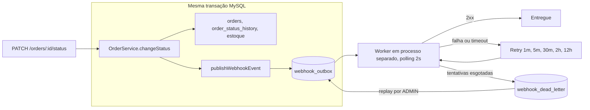

# RFC: Sistema de Webhooks de Notificação de Pedidos

## Metadados

| Campo | Valor |
| --- | --- |
| Autor | Diego Ferreira |
| Status | Em revisão |
| Data | 26/09/2026 |
| Revisores | Larissa (Tech Lead), Marcos (Product Manager), Bruno (Eng. Pleno, Pedidos), Diego (Eng. Sênior, Plataforma), Sofia (Engenharia de Segurança) |
| Documentos relacionados | [PRD](PRD.md), [FDD](FDD.md), [ADRs](adrs/README.md), [Tracker](TRACKER.md) |
| Origem | Reunião técnica registrada em [TRANSCRICAO.md](../TRANSCRICAO.md) |

## 1. Resumo executivo (TL;DR)

Propomos que o OMS passe a notificar os clientes B2B por webhook de saída sempre que o status de um pedido mudar, com latência abaixo de 10 segundos. A mudança de status grava o evento numa tabela de outbox no mesmo MySQL e na mesma transação. Um worker em processo separado lê essa tabela a cada 2 segundos e entrega o evento assinado com HMAC-SHA256. Falhas entram em retry com backoff de até cerca de 15 horas e depois vão para uma DLQ, que só um ADMIN reprocessa. A garantia é at-least-once, e o cliente deduplica pelo `X-Event-Id`. Não entra nenhuma infraestrutura nova. O módulo segue os mesmos padrões do resto do código.

## 2. Contexto e problema

Três clientes B2B (Atlas Comercial, MaxDistribuição e Nova Cargo) pediram formalmente para ser avisados em tempo real quando o status dos pedidos muda. Hoje eles fazem polling periódico no `GET /orders`, o que deixa a integração lenta e cara. A Atlas sinalizou que pode migrar para um concorrente se isso não sair até o fim do trimestre ([09:00] Marcos). Para eles, "tempo real" é qualquer coisa abaixo de 10 segundos ([09:02] Marcos).

A aplicação não tem nenhum mecanismo de notificação externa, fila ou evento. A mudança de status acontece em `OrderService.changeStatus` (`src/modules/orders/order.service.ts`) dentro de uma transação que valida a transição, mexe em estoque, atualiza `orders` e grava `order_status_history`. Qualquer solução precisa conviver com essa transação sem deixá-la mais frágil ([09:04] Bruno).

## 3. Proposta técnica

A proposta tem cinco peças. O detalhe de implementação (tabelas, contratos, erros e fluxos passo a passo) está no [FDD](FDD.md).

**3.1 Captura do evento pela outbox.** Dentro da transação de `changeStatus`, uma função do módulo de webhooks (`publishWebhookEvent`) procura os webhooks ativos do cliente que querem aquele status e grava um evento por webhook na tabela `webhook_outbox`. O payload é gravado pronto, como snapshot do pedido no momento da transição. Se a gravação falhar, a mudança de status inteira dá rollback. Ver [ADR-001](adrs/ADR-001-outbox-no-mysql.md) e [ADR-007](adrs/ADR-007-payload-enxuto-como-snapshot-na-insercao.md).

**3.2 Entrega pelo worker.** Um processo Node separado (`src/worker.ts`, arquivo novo, iniciado com `npm run worker`) consulta a outbox a cada 2 segundos, pega os eventos pendentes mais antigos em lotes pequenos e faz o POST para a URL do cliente, com timeout de 10 segundos. Nesta fase roda uma única instância, o que mantém a ordem de envio por pedido enquanto as entregas dão certo. Ver [ADR-002](adrs/ADR-002-worker-separado-com-polling.md).

**3.3 Falhas, retry e DLQ.** Falhas e timeouts são retentados em 1m, 5m, 30m, 2h e 12h. Depois disso o evento vai para a tabela `webhook_dead_letter`. Um ADMIN pode reenviar o evento pela API, e fica registrado quem fez isso. Ver [ADR-003](adrs/ADR-003-retry-com-backoff-e-dlq.md).

**3.4 Segurança.** Cada webhook tem a sua secret, gerada pela plataforma e rotacionável com 24 horas de carência. O corpo é assinado com HMAC-SHA256 e a assinatura vai em `X-Signature`. Só aceitamos URL https. Ver [ADR-004](adrs/ADR-004-hmac-sha256-com-secret-por-endpoint.md).

**3.5 Contrato com o cliente.** A entrega é at-least-once. Cada evento leva um UUID em `X-Event-Id` para o cliente deduplicar, além de `X-Webhook-Id` e `X-Timestamp`. O cliente gerencia os webhooks por uma API REST autenticada (cadastro, edição, remoção, listagem, rotação de secret e histórico de entregas). Ver [ADR-005](adrs/ADR-005-entrega-at-least-once-com-x-event-id.md).

Tudo isso vive num módulo novo, `src/modules/webhooks` (a criar), que reaproveita `AppError`, Pino, o middleware de erro, os schemas Zod e o `requireRole`. Ver [ADR-006](adrs/ADR-006-reuso-dos-padroes-do-projeto.md).

## 4. Alternativas consideradas

| Alternativa | O que era | Por que foi descartada (trade-off) |
| --- | --- | --- |
| Disparo síncrono no `changeStatus` | Chamar o endpoint do cliente dentro da transação de mudança de status | Um cliente lento travaria mudanças de status de outros pedidos, e não há resposta boa para cliente fora do ar, porque não dá para desfazer a mudança de status ([09:04] Bruno, [09:06] Diego) |
| Redis Streams ou fila dedicada | Publicar o evento numa infraestrutura de mensageria | Resolveria o desacoplamento, mas exige subir e operar infraestrutura nova para um time pequeno, o que foi visto como overengineering. O MySQL existente atende ([09:07] Larissa, [09:07] Diego) |
| Trigger no banco para acordar o worker | Reagir à inserção em vez de fazer polling | O MySQL não tem `LISTEN/NOTIFY`. A trigger não avisa processo externo, e qualquer improviso ficaria esquisito. O polling de 2s já cumpre a meta de 10s ([09:09] Bruno, [09:09] Diego) |
| Retry indefinido, ou só 3 tentativas | Outras políticas de retry | Retry infinito deixa evento pendurado para sempre. Três tentativas se esgotam em uns 30 minutos, e já tivemos manutenção de 2 horas em cliente ([09:15] Diego, [09:16] Bruno, [09:16] Diego) |
| Exactly-once | Garantir entrega única | Exige coordenação dos dois lados e fica muito mais complexo. At-least-once com id de evento é o padrão de mercado ([09:25] Diego) |
| Montar o payload na hora do envio | Guardar só o `order_id` na outbox | Com retry de até 15h, o evento poderia chegar com dados que não correspondem à transição ([09:51] Bruno, [09:52] Larissa) |

## 5. Questões em aberto

Pontos levantados na reunião que não foram decididos ou foram adiados. Nenhum deles bloqueia a primeira entrega.

1. **Rate limiting de saída.** Se um cliente tiver 50 pedidos mudando de status em um minuto, ele recebe 50 chamadas. Ficou como "observar e decidir depois" ([09:38] Diego, [09:39] Larissa). Pergunta para a revisão: qual sinal de observabilidade dispara essa decisão?
2. **Aviso ao cliente quando o webhook falha repetidamente**, por exemplo por email depois de 3 falhas seguidas. Adiado para uma próxima fase, depois de medir o impacto ([09:37] Marcos, [09:37] Larissa).
3. **Escala horizontal do worker.** Com mais de um worker a garantia de ordem por pedido se perde. As opções citadas foram particionar por `order_id` ou usar lock pessimista, mas sem decisão ([09:13] Diego).
4. **Arquivamento da outbox.** Linhas entregues devem ser arquivadas depois de uns 30 dias, mas isso ficou fora do escopo desta feature. Sem dono nem prazo ainda ([09:08] Diego).
5. **Endurecer as permissões do CRUD de webhooks.** Por enquanto qualquer role autenticada gerencia webhooks. Pode ficar mais restrito no futuro ([09:37] Sofia).
6. **Onde passar o `customer_id`.** A reunião definiu que ele não vem do JWT e que vai "no body ou no path" ([09:32] Larissa). O FDD propõe body no cadastro e query string na listagem, igual ao que `order.schemas.ts` faz com `customerId`. Peço confirmação do Bruno e da Larissa.

## 6. Impacto e riscos

**Impacto no sistema existente**
- `changeStatus` ganha uma leitura (webhooks do cliente) e uma escrita (outbox) dentro da transação. Nenhuma mudança de contrato na API de pedidos.
- Três tabelas novas no MySQL e um segundo processo para rodar em produção.
- Nenhuma dependência nova em `package.json`.

**Impacto no time e no prazo**
- Estimativa de três sprints, incluindo a revisão de segurança ([09:46] Larissa).
- Pelo menos dois dias úteis reservados para a Sofia revisar HMAC e geração de secret antes do deploy ([09:46] Sofia).

**Riscos principais**

| Risco | Mitigação proposta |
| --- | --- |
| Falha na outbox bloquear mudanças de status | É intencional (sem evento, sem mudança), mas a escrita é simples e coberta por testes de integração no fluxo de pedidos |
| Cliente processar evento duplicado | `X-Event-Id` estável e documentação destacada no portal ([09:26] Marcos) |
| Secret vazada do lado do cliente | Secret por endpoint e rotação com carência de 24h ([09:21] Sofia, [09:22] Diego) |
| Worker parado acumula eventos | Sem perda, porque a outbox é durável. Precisa de alerta de backlog (ver FDD, Observabilidade) |
| Rajada de eventos para um mesmo cliente | Observar antes de implementar rate limiting (questão em aberto 1) |

## 7. Decisões relacionadas

| ADR | Decisão |
| --- | --- |
| [ADR-001](adrs/ADR-001-outbox-no-mysql.md) | Padrão Outbox no MySQL existente |
| [ADR-002](adrs/ADR-002-worker-separado-com-polling.md) | Worker em processo separado com polling de 2s |
| [ADR-003](adrs/ADR-003-retry-com-backoff-e-dlq.md) | Retry com backoff e DLQ em tabela separada |
| [ADR-004](adrs/ADR-004-hmac-sha256-com-secret-por-endpoint.md) | HMAC-SHA256 com secret por endpoint e rotação |
| [ADR-005](adrs/ADR-005-entrega-at-least-once-com-x-event-id.md) | At-least-once com `X-Event-Id` |
| [ADR-006](adrs/ADR-006-reuso-dos-padroes-do-projeto.md) | Reuso dos padrões existentes do projeto |
| [ADR-007](adrs/ADR-007-payload-enxuto-como-snapshot-na-insercao.md) | Payload enxuto como snapshot na inserção |
